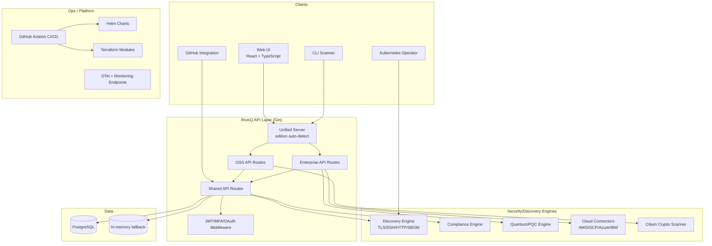
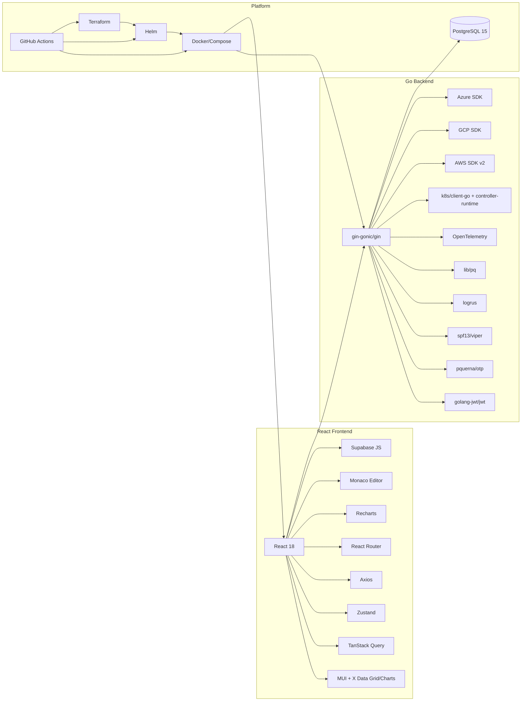

# RivicQ Repository Analysis (Phase 1 Baseline)

## Scope

This document captures a **current-state technical baseline** of the existing RivicQ repository and defines the engineering path to evolve it from Open Source into an Enterprise SaaS platform **without rewriting working modules**.

Repository analyzed: `/workspace`  
Primary stack: Go backend + React/TypeScript frontend + PostgreSQL + Docker/Kubernetes/Terraform deployment assets.

---

## 1) Architecture Diagram

---

## 2) Dependency Graph

---

## 3) Current Features (Implemented Today)

### Platform Core
- CBOM lifecycle APIs and scanning orchestration.
- Asset inventory and BOM retrieval.
- Dashboard metrics and summary views.
- Security event APIs.
- Basic Kubernetes integration.

### Security Scanning
- TLS, SSH, HTTP, SBOM scanning primitives.
- Scan types: quick / cbom / full / compliance.
- GitHub scanning routes.
- Cilium crypto scanner interface (simulated telemetry path).

### Compliance
- Rule engine for multiple frameworks including DORA/NIS2/NIST/CRA/ENISA mappings.
- Compliance status and reporting routes.

### Quantum / Crypto
- Quantum/PQC route surface in enterprise edition.
- PQC-related checks and NIST/FIPS-oriented structures.
- Initial attestation/provider abstractions.

### Enterprise Foundations (Partially Implemented)
- Enterprise route group and license-gated edition switch.
- Multi-cloud inventory connectors (AWS/GCP/Azure/IBM).
- API key and webhook route surface.
- SSO configuration storage endpoints.

### Frontend
- Multi-page React app with OSS + enterprise pages.
- Dashboard, scanner, CSPM, and enterprise module navigation shell.

### Deployment & Operations
- Docker Compose local stack.
- OSS/Enterprise Dockerfiles.
- Helm charts (OSS, Enterprise, SaaS).
- Terraform modules for cloud deployments.
- CI workflows for build/test/lint/security/deploy paths.

---

## 4) Missing Features vs Target Vision

> The repository already has strong building blocks, but most enterprise capabilities are incomplete or skeletal compared to the requested AI-native, quantum-safe, cloud-native end-state.

### Major Gaps

1. **True CNAPP completeness not yet present**
   - CSPM/CWPP/CIEM/DSPM/KSPM/ASPM/SSPM are not fully implemented as independent, production-grade engines.

2. **Identity Security depth is limited**
   - IAM graph, machine identity lifecycle, OAuth/JWT/API token intelligence, JIT access workflows, and continuous authentication are not complete.

3. **Quantum-readiness platform is partial**
   - CBOM exists, but full QBOM/CBOM/PKI/TLS migration planning and automated FIPS 203/204/205 migration workflows remain incomplete.

4. **Supply chain security is not end-to-end**
   - SBOM basics exist; AIBOM/IBOM/VEX/SLSA/Sigstore/Rekor/in-toto provenance verification and trust scoring need full implementation.

5. **AI security platform is mostly a framework**
   - AI inventory, prompt firewall, jailbreak/prompt injection controls, model drift, LLM/RAG scanners, guardrails, and governance controls are not production-complete.

6. **API and runtime security are not full coverage**
   - Shadow/zombie API detection, deep runtime eBPF detection, attack path analytics, and broad policy-driven prevention are still missing.

7. **Enterprise SaaS plane is incomplete**
   - Multi-tenant isolation, billing, subscriptions, full RBAC/SSO/SCIM, usage metering, and customer/partner portals need production completion.

8. **Observability, reliability, and governance maturity**
   - OTel exists, but full SRE-grade reliability controls (durable job queues, comprehensive tracing/log pipelines, SLO/SLA enforcement) are incomplete.

---

## 5) Technical Debt

### Architecture / Platform Debt
- In-memory scan job state (limits horizontal scale and restart resilience).
- Dual schema/migration patterns (inline table creation + migration SQL) risk drift.
- Silent demo fallback behavior when integrations or DB are unavailable.
- OpenAPI spec drift versus actual live routes.

### Security Debt
- Unsafe default secret fallbacks and demo bootstrap credentials.
- Mixed route authentication enforcement (not all critical paths consistently protected).
- Enterprise license gating is simplistic and should be cryptographically verifiable.

### Product Debt
- Several enterprise endpoints return placeholders/simulated data patterns.
- WebSocket/realtime and advanced analytics UX pathways are incomplete.
- Documentation and tests references show stale sections.

---

## 6) Code Quality Report

### Strengths
- Clear package boundaries in backend (`internal/*` domain segmentation).
- Edition split strategy avoids full rewrite and supports open-core evolution.
- Strong deployment artifacts (Docker, Helm, Terraform) for multiple operating models.
- CI pipelines include lint, build, and multiple security-oriented workflows.

### Weaknesses
- Inconsistent test density across packages.
- Handler/service boundaries sometimes mix orchestration and business logic.
- Limited contract tests between API handlers and OpenAPI specification.
- Placeholder/demo logic is mixed with production handlers in key paths.

### Test Posture (Current Snapshot)
- Backend short test suite passes.
- Coverage is uneven; many packages have little or no tests.
- Frontend automated tests are largely absent.

---

## 7) Security Review

### Positive
- JWT + MFA foundations are present.
- RBAC model and permission strings exist.
- Compliance framework support is built into core.
- Security workflows exist in CI (CodeQL, DAST pipeline files).

### Key Risks
1. Default secret/password fallback behavior must be removed for production paths.
2. Authentication/authorization enforcement must be standardized across all sensitive routes.
3. Multi-tenant boundaries need stronger formal verification and isolation tests.
4. Demo-mode behavior must be explicit, restricted, and never implicit in production.
5. License/edition controls require signed validation and tamper resistance.

---

## 8) Performance Review

### Current Strengths
- Lightweight Go service architecture with modular scanners.
- PostgreSQL baseline is suitable for relational inventory/compliance workloads.
- Existing deployment artifacts support scalable environments.

### Bottlenecks / Risks
- In-memory scan manager constrains distributed operation and resilience.
- Potential repeated scan orchestration work due to absent durable queue/executor model.
- Partial observability coverage makes bottleneck detection slower in production.
- Frontend dashboard complexity may grow faster than state/query management abstractions.

### Performance Priorities
1. Introduce durable scan queue + worker model.
2. Add caching and pagination discipline across large inventory endpoints.
3. Expand tracing/metrics around scan lifecycle and cloud integrations.
4. Benchmark risk scoring/graph analytics path early before enterprise expansion.

---

## 9) Enterprise Readiness Score

Scoring rubric: 0 (not ready) to 5 (production-ready).

| Domain | Score | Notes |
|---|---:|---|
| Core architecture | 3.5 | Strong foundation and modularity, needs scaling primitives |
| Cloud-native operations | 3.5 | Good deployment options, deeper SRE controls needed |
| Security controls | 2.8 | Strong intent; hardening and policy consistency required |
| Multi-tenancy / SaaS | 2.3 | Partial foundations, not full SaaS maturity |
| Identity & access | 2.5 | RBAC/JWT/MFA present; advanced identity graph/JIT missing |
| Quantum security depth | 2.6 | Good early components; migration automation not complete |
| Supply chain security | 2.4 | CBOM/SBOM core; full provenance/trust model pending |
| AI security platform | 1.9 | Early route/module structure, limited full controls |
| Test quality & reliability | 2.4 | Uneven coverage; frontend and integration depth needed |
| Compliance automation | 3.0 | Strong baseline mappings; enterprise workflow depth needed |

**Overall Enterprise Readiness Score: 2.7 / 5.0**

Interpretation: solid open-source security platform with meaningful enterprise scaffolding; requires targeted hardening and productization, not a rewrite.

---

## 10) Refactoring & Evolution Plan (No-Rewrite Strategy)

## Guiding Principle
Preserve existing modules and interfaces where functional. Introduce enterprise capabilities via additive layering, adapter patterns, and incremental hardening.

### Wave 1 — Stabilize Foundation
1. Remove insecure defaults; enforce production secret requirements.
2. Normalize authz middleware across protected routes.
3. Unify migrations into a single authoritative pipeline.
4. Align OpenAPI and add contract tests.
5. Isolate demo-mode behavior behind explicit build/runtime flags.

### Wave 2 — SaaS Control Plane
1. Organizations / projects / teams domain model finalization.
2. Tenant-aware RBAC, audit logs, feature flags, API rate limits.
3. Usage metering and subscription scaffolding.
4. SSO/SCIM production implementation.

### Wave 3 — Security Data Plane Expansion
1. Scanner plugin framework standardizing lifecycle:
   - `Discover()`
   - `Fingerprint()`
   - `Scan()`
   - `Analyze()`
   - `RiskScore()`
   - `Compliance()`
   - `GenerateEvidence()`
   - `Export()`
   - `Webhook()`
   - `Streaming()`
   - `History()`
2. Durable asynchronous scan workers.
3. Unified asset graph + cross-domain risk graph.

### Wave 4 — Enterprise Module Completion
1. CNAPP completion (CSPM/CWPP/CIEM/DSPM/KSPM/ASPM/SSPM).
2. Identity security graph and machine identity lifecycle.
3. Quantum migration planner and crypto agility orchestration.
4. API/runtime/network/data security deep modules.
5. Threat intelligence ingestion and detection engineering pack support.

### Wave 5 — AI-Native Copilot + Analytics
1. Unified semantic search across assets/BOM/cloud/logs/code.
2. Copilot workflows (explain/fix/generate policy/rules/reports).
3. Executive + SOC + CISO + board dashboards.
4. Predictive analytics and attack path simulation.

---

## 11) Backward Compatibility Commitments

To preserve Community Edition stability while evolving to Enterprise:

- Keep existing OSS API endpoints operational (versioned additions for breaking changes).
- Maintain existing CLI contract and scanner behavior defaults.
- Continue self-hosted OSS deployment path (Docker/Helm).
- Separate enterprise-only capabilities by feature flags/license checks without regressing OSS workflows.
- Provide migration guides and upgrade tooling per release wave.

---

## 12) Immediate Next Deliverables

1. Architecture Decision Records for:
   - Multi-tenant data isolation model.
   - Scanner plugin runtime/queue design.
   - Identity graph and risk engine schema.
2. `ENTERPRISE_GAP_MATRIX.md` mapping each requested module to:
   - current status,
   - owning package,
   - implementation milestones,
   - test requirements.
3. Security hardening patchset (auth defaults, route protection, config validation).
4. OpenAPI/API conformance test suite and CI gate.

---

## Conclusion

RivicQ is already a credible open-source security platform with an enterprise-oriented codebase trajectory. The fastest path to the requested AI-native, quantum-safe, cloud-native enterprise platform is **progressive hardening + modular expansion**, not replacement. The repository is structurally suitable for transformation, with the highest ROI coming from security hardening, SaaS control-plane completion, durable scan architecture, and unified risk intelligence.
