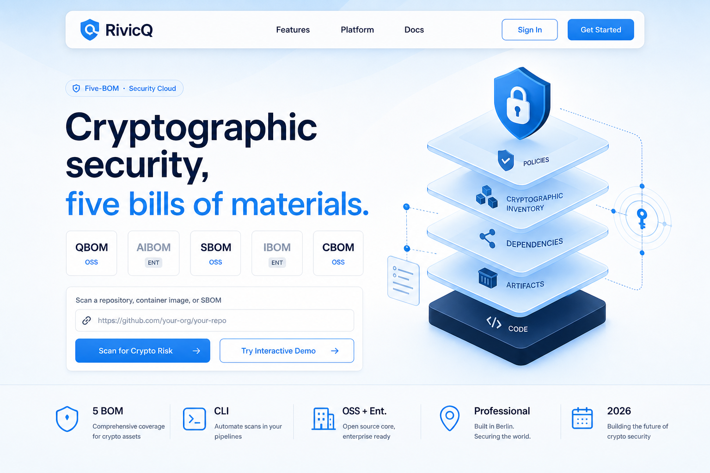
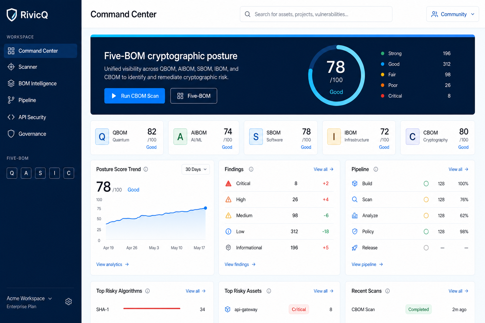

# RivicQ Horizon — core product UX / UI

The current visual system for RivicQ Security Cloud. Sky-blue and white stay the brand. This is not IBM Carbon or IBM Plex.

Live surfaces: public home, Community workspace, Five-BOM hubs, docs hub.

Mockups (also on GitHub Pages after merge):





## Intent

Operators should see **one cryptographic product**, not a pile of enterprise modules.

1. **Five-BOM is the identity** — QBOM · AIBOM · SBOM · IBOM · CBOM tiles on home, app bar, and workspace.
2. **Discover → mitigate → report** remains the only client path.
3. **Community is honest** — locked Enterprise tiles stay visible, never unlabeled as live.
4. **Navy is chrome, sky is canvas** — sidebar and command heroes sit on `#082f49`; pages sit on `#f4f9fd`.

## Visual tokens

| Token | Value | Use |
|---|---|---|
| Sky | `#0ea5e9` / `#0284c7` | Primary actions, links, BOM tiles |
| Horizon wash | radial sky at the top of the page | Public home, auth, workspace canvas |
| Horizon band | `#38bdf8 → #0ea5e9 → #0284c7` | 3px cap on navy heroes |
| Canvas | `#f4f9fd` | Workspace and marketing |
| Navy chrome | `#082f49` | Sidebar, command heroes |
| Type | Outfit 400–800 + JetBrains Mono | UI + metrics |
| Radius | 6 / 10 / 14 / 20 / pill | Cards, pills, search |
| Motion | opacity only | No blur, no neon glow, no hover-lift |

Primary buttons on light pages are **sky fill** (`#0284c7`) with a soft sky shadow. Navy is reserved for chrome, not every CTA.

## Information architecture

```
Public
  Home → Demo | Sign in | Docs
Workspace (Community)
  Command Center → Scanner → Five-BOM
  Pipeline · API security · AI security · HSM/Quantum · Governance · Migration
Enterprise (licensed)
  Cloud posture · Conformance · Inventory · Compliance · Quantum · CSPM
```

Community can open every Five-BOM route. AIBOM, IBOM, HSM connectors, and the GRC pack stay locked until a paid edition.

## Core screens

| Screen | Design |
|---|---|
| **Home** | Pill nav, editorial headline, five BOM letter tiles, scan card, horizon wash |
| **Auth / editions** | Split navy briefing + white form on sky canvas |
| **Command Center** | Navy horizon hero, five-BOM strip, community-first actions |
| **Five-BOM / pipeline / governance** | Shared `PageFrame` navy header + white evidence cards |
| **Docs hub** | Same horizon, pill CTAs, 16px cards |

## Do not

- Restore IBM Plex, Carbon Gray 100, or trademark banners
- Present demo data as customer telemetry
- Treat mappings as certifications
- Require IBM Quantum hardware for QBOM scores
- Claim QSIC as shipped silicon
