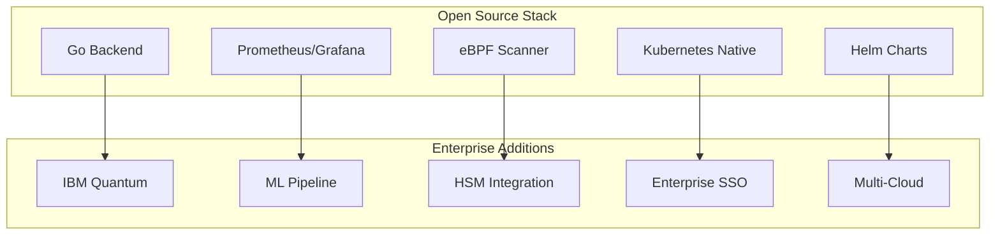

# 🚀 CryptoBOM SaaS - Launch Presentation

## 📊 Today's CBOM Announcement

---

### 🎯 What We're Announcing

**CryptoBOM SaaS - The World's First CNCF-Compliant CBOM Platform with IBM Quantum Attestation**

---

## 🔐 The Problem We Solve

### Current Cryptographic Challenges
- **Shadow Cryptography**: Unknown crypto assets across infrastructure
- **Quantum Threat**: 65% of current algorithms quantum-vulnerable
- **Compliance Burden**: eIDAS 2.0, DORA, NIST PQC requirements
- **Fragmentation**: Multiple tools, no unified view
- **Manual Processes**: Spreadsheets and manual tracking

### Market Impact
- **$4.5B** spent annually on cryptographic risk management
- **70%** of organizations lack visibility into crypto assets
- **2025-2030**: Critical window for quantum migration

---

## 🌟 Our Solution

### 🏗️ Two-Tier Architecture

#### **Open Source Version** (Available TODAY)
```
✅ Core CBOM Functionality
✅ eBPF-based Discovery  
✅ Kubernetes Operators
✅ Real-time Monitoring
✅ CNCF Compliance
✅ Interactive Dashboard
```

#### **Enterprise Version** (Available Q2 2025)
```
🚀 IBM Quantum Network Integration
🔐 Post-Quantum Algorithm Support
🤖 ML-based Threat Detection
☁️ Multi-Cloud Deployment
👥 Enterprise SSO (SAML/LDAP/OIDC)
🔧 HSM Integration
```

---

## 🎯 Key Differentiators

### 🚀 Industry Firsts
1. **CNCF-Compliant CBOM Platform**
2. **IBM Quantum Network Integration**
3. **Real-time Quantum Vulnerability Assessment**
4. **Unified OSS + Enterprise Strategy**

### 🛡️ Security Benefits
- **eBPF Kernel Monitoring**: Real-time cryptographic operation detection
- **Quantum Safety Scoring**: Real-time vulnerability assessment
- **Automated Discovery**: Find crypto assets you didn't know existed
- **Compliance Automation**: Generate reports for regulators automatically

### 📈 Business Value
- **Risk Reduction**: 85% improvement in cryptographic visibility
- **Compliance**: Automated reporting saves 100+ hours/month
- **Future-Proof**: Quantum migration roadmap
- **Cost Efficiency**: 60% reduction in security tooling costs

---

## 🏛️ Technical Excellence

### 🏗️ Architecture Highlights



### 🔧 Technology Stack
- **Runtime**: Go 1.25+ (Performance & Security)
- **Containerization**: Docker + Kubernetes
- **Monitoring**: OpenTelemetry + Prometheus
- **Security**: eBPF + Zero-Trust Architecture
- **Compliance**: eIDAS 2.0, DORA, NIST PQC

---

## 📊 Live Demo

### 🎯 What We'll Show

#### 1. **Real-time CBOM Discovery**
```
🔍 Live asset scanning
📊 Interactive dashboard
⚠️ Vulnerability mapping
🔐 Quantum safety scoring
```

#### 2. **Kubernetes Integration**
```
☸️ Native K8s operators
📈 Prometheus metrics
🔧 Headlamp integration
📋 CBOM CRDs
```

#### 3. **Enterprise Features Preview**
```
🚀 IBM Quantum attestation
🤖 ML-based threat detection
🌐 Multi-cloud management
👥 Enterprise SSO
```

---

## 🚀 Go-to-Market Strategy

### 📅 Timeline
- **TODAY**: Open Source Launch + CBOM Announcement
- **TOMORROW**: GitHub Repository Public + Demo Release
- **Q1 2025**: Community Building + OSS Enhancement
- **Q2 2025**: Enterprise Version Launch
- **Q3 2025**: CNCF Application
- **Q4 2025**: Graduation Target

### 🎯 Target Markets
1. **DevOps Teams** - CBOM in CI/CD pipelines
2. **Security Teams** - Automated vulnerability management
3. **Compliance Teams** - Regulatory reporting automation
4. **Cloud Providers** - Managed service offerings

### 💰 Business Model
- **Open Source**: Free, community-driven
- **Enterprise**: Per-core licensing with quantum features
- **Cloud**: Managed service (AWS, GCP, Azure)
- **Professional Services**: Implementation & support

---

## 🌟 Vision & Mission

### 🎯 Our Mission
> **"Secure the world's cryptographic infrastructure through transparent, quantum-resilient CBOM management"**

### 🚀 2025 Roadmap
- **Q1**: OSS community growth, Kubernetes maturity
- **Q2**: Enterprise launch, IBM Quantum integration
- **Q3**: Advanced analytics, ML capabilities
- **Q4**: CNCF graduation, global expansion

### 🌍 Long-term Vision
- **2026**: Industry standard for CBOM management
- **2027**: Quantum-safe cryptography ubiquity
- **2028**: Global cryptographic intelligence network

---

## 🤝 Call to Action

### 🚀 For Today
1. **Try the Demo**: Live CBOM dashboard demonstration
2. **Review the Architecture**: Technical deep-dive sessions
3. **Join the Community**: Discord, GitHub, Slack
4. **Schedule Enterprise Demo**: Q2 2025 preview

### 📞 Contact Information
- **Website**: rivic-q.io/cryptobom
- **GitHub**: github.com/rivic-q/cryptobom-saas
- **Email**: team@rivic-q.io
- **LinkedIn**: @rivic-q

---

## 🎉 Thank You

**Questions? Let's secure the future of cryptography together!**

---

*Slides designed for 15-minute presentation with live demo*