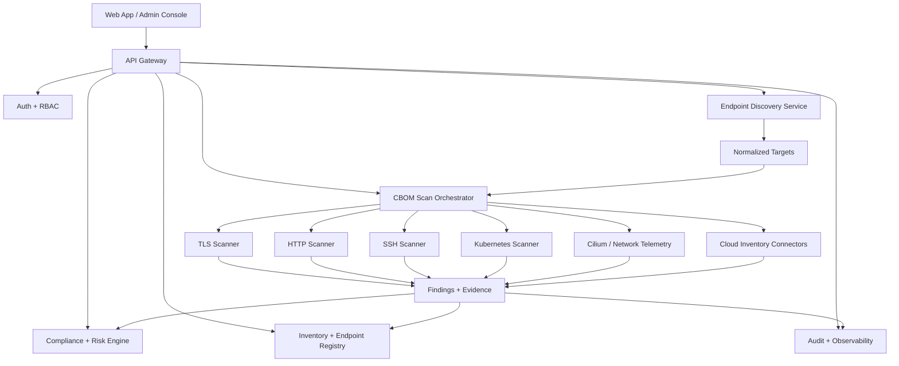

# RivicQ CryptoBOM Redesign, CBOM Endpoint Detection, and Flyingduck Pilot Plan

## Purpose

This document defines the next-phase product redesign for RivicQ CryptoBOM, with a focus on:

- Open-source-first delivery aligned with CNCF-friendly deployment patterns
- Enterprise-grade integrations for multi-tenant SaaS and compliance workflows
- Clear CBOM endpoint discovery and scanning behavior
- A pilot-customer execution plan for Flyingduck
- Benchmark targets and release gates for the redesigned platform

The intent is to preserve the current OSS feature set, extend it into a more modular SaaS architecture, and make the product easier to adopt by security teams, platform teams, and R&D engineering groups.

---

## 1. Product Direction

### 1.1 Core Identity

RivicQ should be positioned as a cryptographic operations and CBOM platform that helps organizations:

- Discover cryptographic assets across endpoints, applications, and infrastructure
- Score risk against modern crypto and PQC guidance
- Operationalize remediation with workflows that security and platform teams can actually use
- Provide an OSS edition for self-hosted community usage and an enterprise edition for governance, scale, and multi-tenant administration

### 1.2 OSS Foundation

The OSS edition should remain the default entry point and include:

- CBOM scanning and report generation
- Local endpoint discovery for TLS, HTTP, SSH, and Kubernetes targets
- Basic inventory and dashboard views
- Compliance summaries and risk scoring
- Local-first operation with no mandatory cloud dependency

### 1.3 Enterprise Integration

Enterprise should add:

- SSO, SCIM, MFA, and federated access controls
- Multi-tenant isolation and tenant-specific policies
- Cloud integrations for AWS, GCP, and IBM Cloud
- HSM/KMS-backed key workflows
- Compliance and audit reporting
- Central governance for security teams and admins

---

## 2. Current Endpoint Detection and CBOM Scanning

### 2.1 Current Public API Surfaces

The current project already exposes the core scanning and inventory endpoints through the main API router:

- `POST /api/v1/scans` to start a CBOM scan
- `GET /api/v1/scans/:id` to poll status and results
- `GET /api/v1/cbom` for CBOM reports
- `GET /api/v1/cbom/:id` for a specific report
- `POST /api/v1/cbom/:id/scan` to rescan a report
- `GET /api/v1/assets` for crypto assets
- `GET /api/v1/assets/:id/bom` for a specific asset BOM
- `GET /api/v1/dashboard/overview` and `GET /api/v1/dashboard/metrics` for summary views
- `GET /api/v1/cilium/flows`, `GET /api/v1/cilium/policies`, `GET /api/v1/cilium/metrics` for network-crypto telemetry
- `GET /api/v1/kubernetes/clusters/:id/status` and `POST /api/v1/kubernetes/clusters/:id/scan` for cluster discovery

These are wired through the main API router in [internal/api/handlers.go](../internal/api/handlers.go) and the OSS router in [internal/api/oss/handlers.go](../internal/api/oss/handlers.go).

### 2.2 Current Endpoint Discovery Model

The current scanner model is active probing, not passive telemetry only.

It works by building `Target` objects with:

- host
- port
- protocol
- label

The current scanner implementations live in [internal/discovery/types.go](../internal/discovery/types.go), [internal/discovery/http_scanner.go](../internal/discovery/http_scanner.go), [internal/discovery/tls_scanner.go](../internal/discovery/tls_scanner.go), and [internal/discovery/ssh_scanner.go](../internal/discovery/ssh_scanner.go).

#### HTTP endpoint detection

The HTTP scanner currently:

- Builds a target URL from host and port
- Issues a GET request to the target
- Checks for weak patterns in the response body
- Flags missing security headers like HSTS, X-Content-Type-Options, and X-Frame-Options

This is useful for identifying weak endpoint behavior, but it should be extended into a richer endpoint inventory service.

#### TLS endpoint detection

The TLS scanner currently:

- Connects to a TLS endpoint with intentionally permissive scan-mode settings
- Captures negotiated TLS version and cipher suite
- Inspects the peer certificate
- Flags weak TLS versions, weak cipher suites, and weak key material

#### SSH endpoint detection

The SSH scanner currently:

- Dials the endpoint with a scan-safe SSH client configuration
- Captures host key algorithm and KEX characteristics
- Flags weak host keys and obsolete key exchange algorithms

### 2.3 What the current model does well

- It already maps scan results to structured findings
- It already has protocol-specific scanners
- It already supports clear remediation text and compliance references
- It is simple enough for pilot use and easy to explain to customers

### 2.4 What the current model still needs

- Endpoint ingestion from multiple sources beyond manual host/port entry
- A canonical endpoint registry with lifecycle state
- Passive discovery from Kubernetes, Cilium, cloud inventories, and agent telemetry
- Safe scanning modes for production pilots
- Better deduplication and correlation across repeated scan runs
- Endpoint risk history and change tracking

---

## 3. Redesign Architecture

### 3.1 Proposed Layered Model

### 3.2 Design Principles

- OSS first, enterprise optional
- API-first and event-aware
- Minimize modal complexity in the UI
- Prefer progressive disclosure over dense screens
- Make endpoints, findings, and ownership explicit
- Treat benchmark data as product evidence, not marketing decoration

### 3.3 Core Services

#### Endpoint Registry

The registry should become the system of record for:

- endpoints
- ownership
- environment
- risk state
- scan history
- allowed scan profile

#### Scan Orchestrator

Responsible for:

- job scheduling
- scanner selection
- retries and backoff
- timeouts and safety gates
- evidence collection
- result aggregation

#### Risk and Compliance Engine

Responsible for:

- crypto posture scoring
- policy checks
- remediation guidance
- benchmark summaries
- enterprise compliance reports

---

## 4. OSS + CNCF-Aligned Experience

### 4.1 OSS Product Experience

The OSS experience should feel like a CNCF-friendly security control plane:

- Docker Compose for local use
- Kubernetes deployment as the primary production model
- Clear environment-variable configuration
- No hardcoded credentials
- Simple single-tenant default mode
- Self-service scan and report generation

### 4.2 OSS Feature Scope

Include:

- CBOM scan orchestration
- Endpoint discovery for TLS, HTTP, SSH, and Kubernetes
- Inventory and BOM views
- Basic compliance and risk scoring
- Local benchmark display
- Exportable reports

Exclude from OSS default:

- SSO/SCIM
- Dedicated tenant isolation controls
- HSM-backed key management orchestration
- Advanced SIEM integrations
- White-label controls

### 4.3 Enterprise Enhancements

Enterprise should add:

- tenant-aware endpoint ownership
- RBAC-driven scan permissions
- multi-region workloads
- role-specific dashboards
- AI-assisted triage and remediation suggestions
- integration connectors for CNAPP, SIEM, and ITSM tools

---

## 5. Client Endpoint Scanning Model

### 5.1 Scanning a Client Environment

For a pilot customer, the scanning path should be:

1. Register the customer workspace and confirm consent
2. Define scope: domains, subnets, clusters, repos, cloud accounts
3. Import endpoint inventory from available sources
4. Resolve endpoints into normalized targets
5. Run protocol-specific scans in safe mode first
6. Correlate findings into CBOM and crypto-risk records
7. Present a triage-ready remediation backlog
8. Re-run in verification mode after fixes

### 5.2 Endpoint Sources

Use a hybrid discovery approach:

- manual endpoint entry
- cloud inventory imports
- Kubernetes cluster and ingress inventory
- Cilium / network flow telemetry
- agent-based endpoint reports
- API gateway and service mesh telemetry
- repository and artifact scans

### 5.3 Security Boundaries

The platform should enforce:

- explicit scan scope approval
- rate-limited active probing
- allowlist-based scanning in pilot mode
- audit trails for every scan
- scan window control
- notification for sensitive endpoints

---

## 6. Flyingduck Pilot Customer Flow

### 6.1 Pilot Objective

Flyingduck should be treated as a design partner pilot customer for validating:

- CBOM accuracy
- client endpoint coverage
- scan safety
- reporting clarity
- onboarding speed
- remediation workflow usefulness

### 6.2 Pilot Sequence

#### Phase 1: Discovery and Scoping

- Confirm scope of allowed assets
- Identify public endpoints, internal endpoints, Kubernetes clusters, and cloud accounts
- Define excluded systems and maintenance windows

#### Phase 2: Access and Credentials

- Use least-privilege access
- Never request or store shared passwords in the UI
- Prefer short-lived tokens, service accounts, or API tokens in a secure secret manager
- Separate OSS demo access from pilot production access

#### Phase 3: Initial Baseline Scan

- Run a low-risk discovery pass
- Capture TLS, HTTP, and SSH exposure
- Build endpoint inventory
- Generate first CBOM snapshot

#### Phase 4: Validation and Triage

- Review top risks with the customer team
- Confirm false positives
- Tag systems by ownership and priority

#### Phase 5: Remediation Loop

- Export findings into ticketing or workflow systems
- Re-scan after fixes
- Measure drift and improvement

### 6.3 Pilot Success Criteria

- 90%+ of in-scope endpoints mapped to ownership
- 100% of scanned endpoints have evidence and remediation notes
- Initial findings are understandable by both security and engineering teams
- Scan runtime is predictable and safe for production use
- Customer can reproduce results and verify fixes

---

## 7. Benchmark Model

### 7.1 Current Reference Baseline

The current product benchmark panel already uses a 10k-asset reference dataset with these internal reference values:

- throughput: 1,420 requests/sec
- p95 latency: 186 ms
- CBOM batch scan time: 6.8 s
- benchmark score: 91%
- dataset size: 10,000 assets
- compliance score: 88%

These values are useful as a product baseline and should be treated as an internal reference point, not a universal industry guarantee.

### 7.2 Public-Facing Benchmark Categories

Benchmark the product using publicly understandable categories:

- discovery speed
- endpoint coverage
- scan latency
- remediation cycle time
- dashboard rendering latency
- API responsiveness
- report generation time
- tenant isolation overhead
- upgrade safety

### 7.3 Target Benchmark Table

| Category | OSS Target | Enterprise Target | Notes |
|---|---:|---:|---|
| First endpoint discovery | < 30 s | < 15 s | Pilot network size |
| CBOM scan latency p95 | < 250 ms | < 200 ms | API and report retrieval |
| Batch scan time | < 10 s | < 7 s | 10k-asset reference |
| Dashboard initial load | < 2.5 s | < 2 s | On standard broadband |
| Triage to ticket export | < 2 min | < 1 min | Workflow efficiency |
| Scan safety incidents | 0 | 0 | Must remain zero |
| False-positive rate | < 15% | < 10% | Improve over time |
| Tenant scope leakage | 0 | 0 | Hard security gate |

### 7.4 Benchmark Philosophy

Benchmarking should answer:

- Can the user find and scan endpoints quickly?
- Can the security team understand the risk story?
- Can the platform scale without making the UX worse?
- Can the pilot customer validate outcomes fast enough to trust the product?

---

## 8. New Features To Implement Next

### 8.1 Endpoint Discovery Enhancements

- Endpoint registry and ownership model
- Passive + active hybrid discovery
- DNS and certificate inventory correlation
- Service mesh and ingress mapping
- Risk change tracking over time

### 8.2 CBOM Enhancements

- Add endpoint graph visualization
- Add scan profiles: safe, standard, deep, and compliance
- Add evidence timeline per asset
- Add remediation owner assignment
- Add diff view between scans

### 8.3 AI-Assisted Workflows

- Summarize findings in plain language
- Suggest remediation order by risk and effort
- Detect duplicate or redundant alerts
- Recommend benchmark regressions

### 8.4 Enterprise Integration Enhancements

- SSO/SCIM onboarding
- SIEM export
- ITSM ticket creation
- Cloud and HSM inventory sync
- Tenant-level policy templates

---

## 9. Architecture for the Research + Development Engineering Team

### 9.1 Team Operating Model

The R&D team should work in three tracks:

1. **Discovery track**: endpoint collection, inventory quality, scan safety
2. **Platform track**: tenancy, orchestration, auth, observability
3. **Product track**: dashboards, onboarding, reporting, developer experience

### 9.2 Engineering Priorities

- Make the endpoint registry the source of truth
- Keep the scan engine protocol-specific and testable
- Keep the UI minimal and task-driven
- Keep OSS and enterprise code paths clearly separated
- Instrument everything with traces, metrics, and audit logs

### 9.3 Suggested Ownership Boundaries

- Discovery service owns normalization and endpoint lifecycle
- Scanner workers own protocol checks and evidence generation
- Compliance engine owns scoring and reports
- Web app owns presentation and workflow routing
- Enterprise layer owns tenant policy and integrations

---

## 10. Release Readiness Gating

Before the first pilot customer launch, verify:

- no hardcoded secrets in UI or docs
- demo access is isolated from production access
- endpoint scanning is allowlisted and auditable
- benchmark baselines are documented
- scan safety controls are enabled
- OSS and enterprise routes are visually distinct
- pilot scope can be exported and reviewed

---

## 11. Summary

RivicQ already has the right foundations for a serious CBOM platform:

- endpoint-aware scanners
- inventory and compliance data models
- OSS and enterprise route separation
- benchmark surfaces in the UI
- a stable API-first foundation

The next redesign should make these foundations easier to understand and easier to operate:

- one clear onboarding path
- one endpoint registry
- one scan orchestration model
- one risk language across the product
- one pilot-customer workflow for Flyingduck and future design partners
