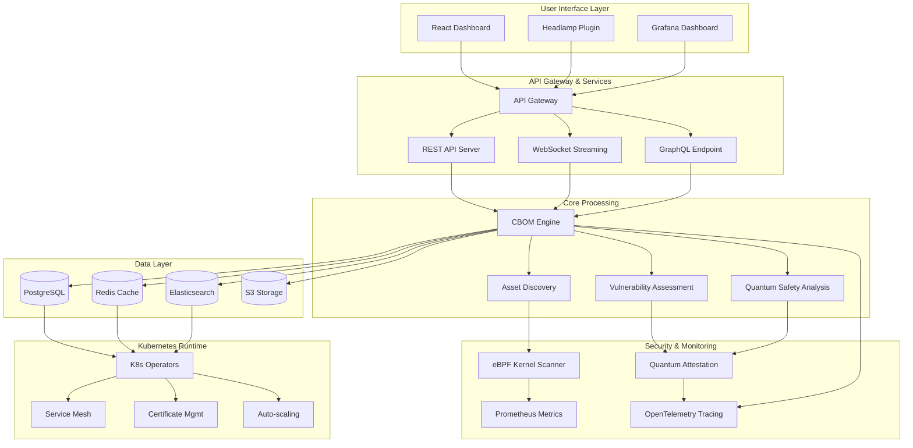
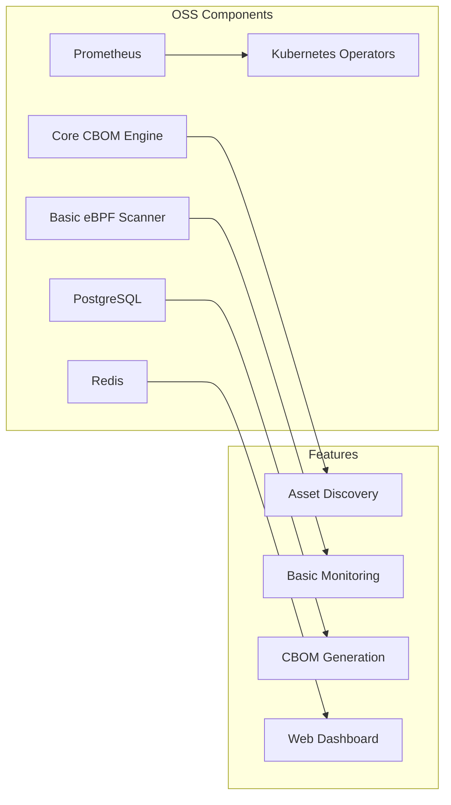
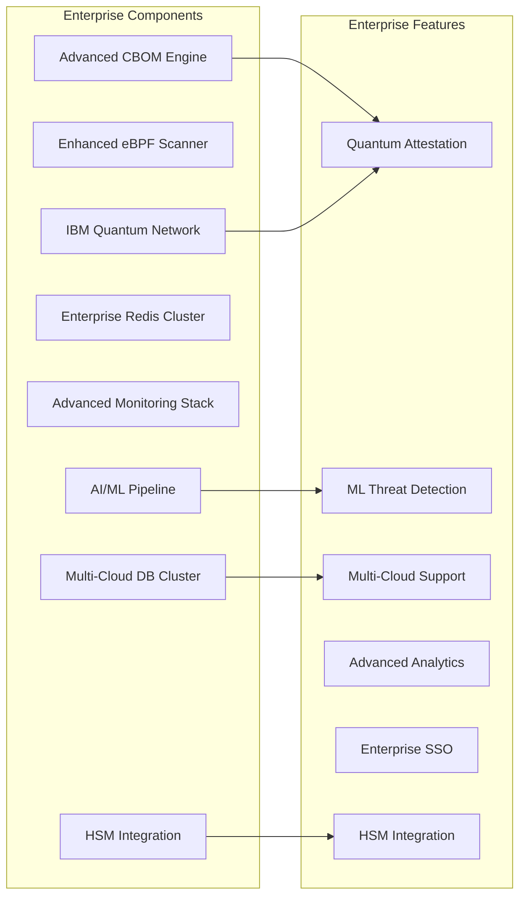
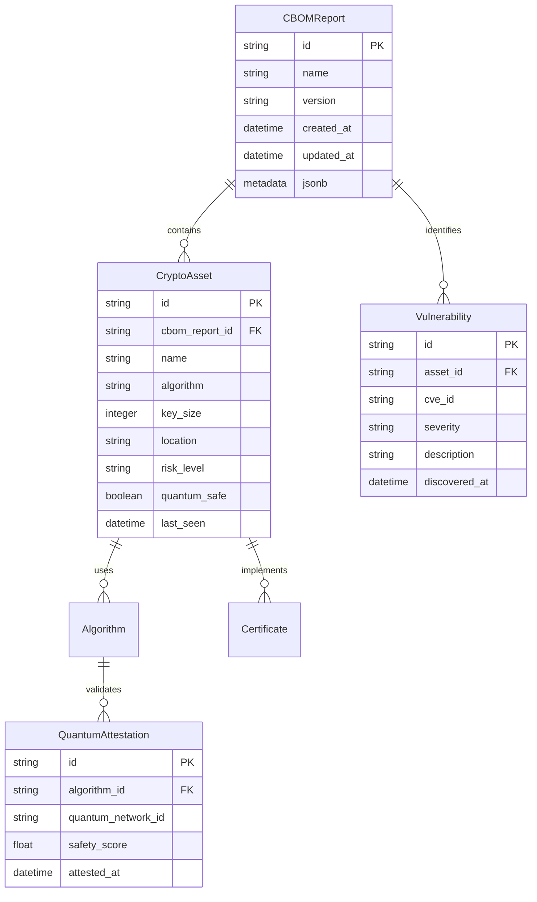
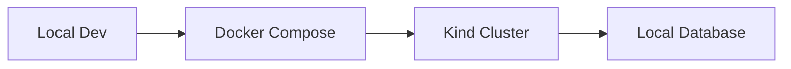
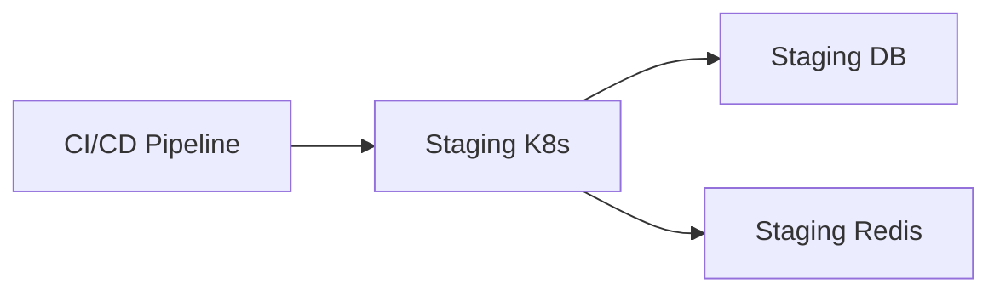
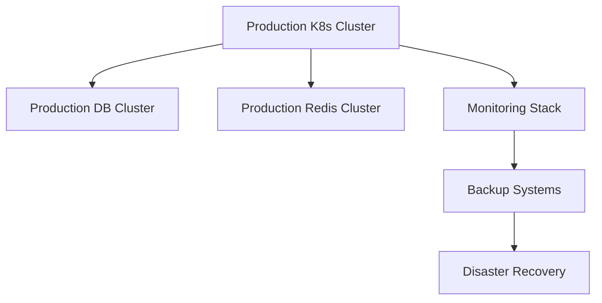

# CryptoBOM SaaS - System Architecture

## 🏗️ Overview Architecture



## 🚀 Open Source vs Enterprise Architecture

### Open Source Architecture


### Enterprise Architecture


## 📊 Data Flow Architecture

```mermaid
sequenceDiagram
    participant U as User
    participant UI as Dashboard
    participant API as API Gateway
    participant CBOM as CBOM Engine
    participant Scanner as eBPF Scanner
    participant DB as Database
    participant Quantum as IBM Quantum
    
    U->>UI: Request CBOM Report
    UI->>API: GET /api/v1/cbom
    API->>CBOM: Fetch CBOM Data
    CBOM->>DB: Query Assets
    
    parallel Asset Discovery
        CBOM->>Scanner: Start Scan
        Scanner->>CBOM: Crypto Events
        CBOM->>DB: Store Assets
    and Quantum Attestation
        CBOM->>Quantum: Validate Algorithms
        Quantum->>CBOM: Quantum Safety Score
        CBOM->>DB: Update Safety Status
    end
    
    CBOM->>API: CBOM Response
    API->>UI: JSON Data
    UI->>U: Display Dashboard
```

## 🔒 Security Architecture

```mermaid
graph TB
    subgraph "Security Layers"
        L1[Network Security]
        L2[Container Security]
        L3[Application Security]
        L4[Data Security]
        L5[Compliance Security]
    end
    
    subgraph "Network Layer"
        NS1[Network Policies]
        NS2[Service Mesh mTLS]
        NS3[WAF Protection]
        NS4[DDoS Protection]
    end
    
    subgraph "Container Layer"
        CS1[Container Scanning]
        CS2[eBPF Monitoring]
        CS3[Runtime Protection]
        CS4[Image Signing]
    end
    
    subgraph "Application Layer"
        AS1[OAuth2/JWT Auth]
        AS2[Rate Limiting]
        AS3[Input Validation]
        AS4[CORS Protection]
    end
    
    subgraph "Data Layer"
        DS1[Encryption at Rest]
        DS2[Encryption in Transit]
        DS3[Key Rotation]
        DS4[Access Controls]
    end
    
    subgraph "Compliance Layer"
        CP1[Audit Logging]
        CP2[Compliance Reporting]
        CP3[eIDAS 2.0]
        CP4[NIST PQC]
    end
    
    L1 --> NS1
    L1 --> NS2
    L2 --> CS1
    L3 --> AS1
    L4 --> DS1
    L5 --> CP1
```



## 🌐 Multi-Cloud Architecture

```mermaid
graph TB
    subgraph "AWS"
        AWS[EKS Cluster]
        AWS_S3[S3 Storage]
        AWS_RDS[RDS PostgreSQL]
        AWS_RE[ElastiCache Redis]
        AWS_LB[Application Load Balancer]
    end
    
    subgraph "Google Cloud"
        GCP[GKE Cluster]
        GCP_CS[Cloud Storage]
        GCP_SQL[Cloud SQL]
        GCP_MC[Memorystore]
        GCP_LB[Cloud Load Balancer]
    end
    
    subgraph "Azure"
        AZ[AKS Cluster]
        AZ_B[Azure Blob Storage]
        AZ_DB[Azure Database]
        AZ_RE[Azure Cache]
        AZ_LB[Azure Load Balancer]
    end
    
    subgraph "Central Management"
        MGMT[Central Control Plane]
        MON[Global Monitoring]
        SYNC[Multi-Cloud Sync]
        BACK[DR/Backup]
    end
    
    AWS --> MGMT
    GCP --> MGMT
    AZ --> MGMT
    
    MGMT --> MON
    MGMT --> SYNC
    MGMT --> BACK
```

## 🔧 Technology Stack

### Backend Services
- **Runtime**: Go 1.25+
- **Framework**: Gin Web Framework
- **Database**: PostgreSQL (Primary), Redis (Cache)
- **Search**: Elasticsearch (Logs & Analytics)
- **Storage**: S3-compatible Object Storage
- **Message Queue**: Redis Pub/Sub
- **Authentication**: JWT, OAuth2, SAML

### Monitoring & Observability
- **Metrics**: Prometheus + Grafana
- **Tracing**: OpenTelemetry + Jaeger
- **Logging**: ELK Stack (Elasticsearch, Logstash, Kibana)
- **eBPF**: Cilium eBPF for kernel-level monitoring

### Container & Orchestration
- **Container**: Docker
- **Orchestration**: Kubernetes 1.25+
- **Service Mesh**: Istio/Linkerd
- **Ingress**: NGINX/Traefik
- **Package Management**: Helm 3.0+

### Security & Compliance
- **Scanning**: Trivy, Clair
- **Network Policies**: Calico/Cilium
- **Secrets Management**: HashiCorp Vault
- **Compliance**: eIDAS 2.0, NIST PQC, DORA, ISO 27001

### Enterprise Features
- **Quantum Integration**: IBM Quantum Network
- **ML Platform**: TensorFlow, Kubeflow
- **Multi-Cloud**: AWS, GCP, Azure
- **SSO**: SAML, LDAP, OIDC
- **HSM**: AWS CloudHSM, Azure Key Vault

## 📈 Performance & Scalability

### Scalability Targets
- **Concurrent Users**: 10,000+ active users
- **API Response Time**: < 100ms (95th percentile)
- **CBOM Generation**: < 30 seconds for 1000 assets
- **Database Throughput**: 50,000+ TPS
- **Auto-scaling**: 0-1000 pods

### Performance Optimizations
- **Caching**: Redis for frequently accessed data
- **Database**: Connection pooling, read replicas
- **CDN**: Content delivery for static assets
- **Compression**: gzip, Brotli for API responses
- **Load Balancing**: Horizontal pod autoscaler

### High Availability
- **Multi-Zone**: Cross-AZ deployment
- **Multi-Region**: Geographic redundancy
- **Failover**: Automatic health checks
- **Backup**: Point-in-time recovery
- **DR**: Disaster recovery procedures

## 🔍 CBOM Data Model



## 🚀 Deployment Architecture

### Development Environment


### Staging Environment


### Production Environment


This architecture provides a comprehensive foundation for both open source and enterprise deployments, ensuring scalability, security, and compliance requirements are met.