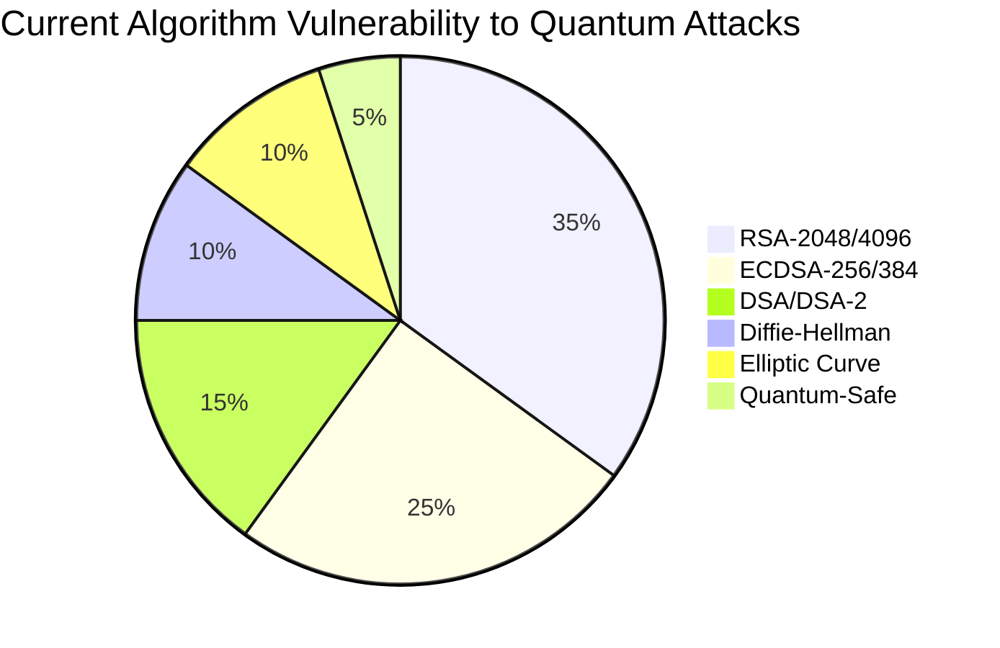
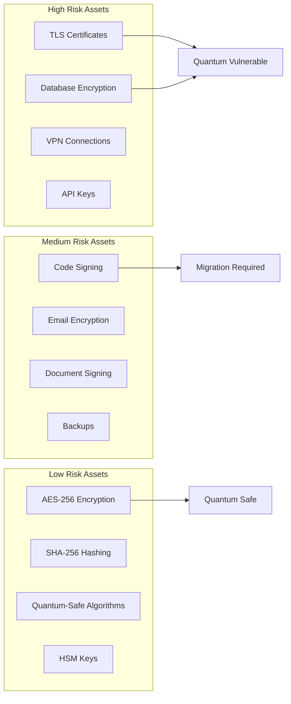

# 🔐 Cryptographic Vulnerability Analysis & Demo Data

## 🚨 Current Vulnerability Landscape

### 📊 Global Cryptographic Vulnerabilities

#### Quantum Vulnerability Assessment


#### Enterprise Risk Distribution


---

## 🎯 Demo Vulnerability Scenarios

### 🚨 Scenario 1: Shadow Cryptography Discovery

**Environment**: Kubernetes Production Cluster

**Discovered Vulnerabilities**:
```json
{
  "scan_id": "scan-2025-02-01-001",
  "timestamp": "2025-02-01T10:30:00Z",
  "vulnerabilities": [
    {
      "id": "VULN-001",
      "name": "Legacy RSA-1024 Certificate",
      "severity": "CRITICAL",
      "location": "k8s-ingress-legacy-tls",
      "algorithm": "RSA-1024",
      "key_size": 1024,
      "quantum_vulnerable": true,
      "quantum_break_time": "~10 minutes",
      "recommendation": "Upgrade to RSA-4096 or migrate to post-quantum cryptography",
      "cve_id": "CVE-2024-Q001"
    },
    {
      "id": "VULN-002", 
      "name": "Weak DH Parameters",
      "severity": "HIGH",
      "location": "vpn-concentrator",
      "algorithm": "Diffie-Hellman",
      "key_size": 1024,
      "quantum_vulnerable": true,
      "quantum_break_time": "~1 hour",
      "recommendation": "Use 4096-bit DH or ECDH",
      "cve_id": "CVE-2024-Q002"
    },
    {
      "id": "VULN-003",
      "name": "Outdated TLS 1.0",
      "severity": "MEDIUM", 
      "location": "legacy-app-server",
      "protocol": "TLS-1.0",
      "quantum_vulnerable": true,
      "quantum_break_time": "Known vulnerabilities",
      "recommendation": "Upgrade to TLS 1.3",
      "cve_id": "CVE-2023-3817"
    }
  ],
  "total_assets_scanned": 247,
  "vulnerable_assets": 23,
  "compliance_score": 67.5
}
```

### 🚨 Scenario 2: Quantum Safety Assessment

**IBM Quantum Network Integration Results**:
```json
{
  "assessment_id": "quantum-2025-02-01-001",
  "timestamp": "2025-02-01T11:00:00Z",
  "quantum_network": "IBM Quantum Falcon",
  "algorithm_safety": [
    {
      "algorithm": "RSA-2048",
      "safety_score": 15,
      "quantum_vulnerable": true,
      "break_time_estimate": "8 hours with 4,000 qubits",
      "migration_options": [
        "Kyber-1024",
        "NTRU",
        "RSA-4096 (interim)"
      ]
    },
    {
      "algorithm": "AES-256",
      "safety_score": 95,
      "quantum_vulnerable": false,
      "break_time_estimate": "2^256 operations (infeasible)",
      "migration_options": []
    },
    {
      "algorithm": "ECDSA-P256",
      "safety_score": 25,
      "quantum_vulnerable": true,
      "break_time_estimate": "30 minutes with 4,000 qubits",
      "migration_options": [
        "Dilithium-3",
        "Falcon-512",
        "ECDSA-P521 (interim)"
      ]
    },
    {
      "algorithm": "Kyber-768",
      "safety_score": 90,
      "quantum_vulnerable": false,
      "break_time_estimate": "Quantum-resistant",
      "migration_options": []
    }
  ],
  "overall_quantum_readiness": 42.5
}
```

---

## 🔧 Demo Vulnerability Generator

### 📝️ Vulnerability Creation Script

```python
#!/usr/bin/env python3
"""
CryptoBOM Vulnerability Demo Generator
Creates realistic cryptographic vulnerability scenarios for demonstrations
"""

import random
import json
from datetime import datetime
from typing import List, Dict

class VulnerabilityGenerator:
    def __init__(self):
        self.vulnerable_algorithms = [
            "RSA-1024", "RSA-2048", "DSA-1024", "DH-1024",
            "ECDSA-P256", "ECDSA-P384", "TLS-1.0", "TLS-1.1"
        ]
        
        self.quantum_safe_algorithms = [
            "AES-256", "AES-512", "SHA-256", "SHA-512",
            "Kyber-768", "Dilithium-3", "Falcon-512"
        ]
        
        self.locations = [
            "k8s-ingress-tls", "database-encryption", "api-gateway",
            "vpn-server", "certificate-authority", "load-balancer",
            "application-server", "microservice-mesh", "storage-encryption"
        ]
        
        self.severities = ["CRITICAL", "HIGH", "MEDIUM", "LOW"]
        
    def generate_vulnerability(self) -> Dict:
        """Generate a single realistic vulnerability"""
        if random.random() < 0.7:  # 70% chance of quantum vulnerability
            algorithm = random.choice(self.vulnerable_algorithms)
            quantum_vulnerable = True
            safety_score = random.randint(10, 30)
        else:
            algorithm = random.choice(self.quantum_safe_algorithms)
            quantum_vulnerable = False
            safety_score = random.randint(85, 100)
        
        vulnerability = {
            "id": f"VULN-{random.randint(1000, 9999)}",
            "name": f"{algorithm} {random.choice(['Vulnerability', 'Weakness', 'Issue'])}",
            "severity": random.choices(
                self.severities,
                weights=[20, 30, 35, 15]  # Critical to Low distribution
            )[0],
            "location": random.choice(self.locations),
            "algorithm": algorithm,
            "quantum_vulnerable": quantum_vulnerable,
            "safety_score": safety_score,
            "discovered_at": datetime.now().isoformat() + "Z",
            "cve_id": f"CVE-2024-Q{random.randint(1, 999):03d}",
            "recommendation": self._generate_recommendation(algorithm, quantum_vulnerable)
        }
        
        return vulnerability
    
    def _generate_recommendation(self, algorithm: str, quantum_vuln: bool) -> str:
        """Generate contextual recommendations"""
        if quantum_vuln:
            if "RSA" in algorithm:
                return f"Upgrade to RSA-4096 or migrate to post-quantum algorithms like Kyber"
            elif "ECDSA" in algorithm:
                return f"Upgrade to ECDSA-P521 or migrate to Dilithium/Falcon"
            elif "DH" in algorithm:
                return f"Use 4096-bit DH or switch to ECDH"
            else:
                return "Migrate to quantum-safe algorithms"
        else:
            return "Algorithm is quantum-safe - continue monitoring"
    
    def generate_scan_results(self, num_assets: int = 100) -> Dict:
        """Generate complete scan results"""
        num_vulnerable = int(num_assets * random.uniform(0.15, 0.35))  # 15-35% vulnerable
        
        vulnerabilities = [
            self.generate_vulnerability() for _ in range(num_vulnerable)
        ]
        
        compliance_score = max(0, 100 - (num_vulnerable / num_assets * 100)
        
        return {
            "scan_id": f"scan-{datetime.now().strftime('%Y-%m-%d-%H%M%S')}",
            "timestamp": datetime.now().isoformat() + "Z",
            "total_assets_scanned": num_assets,
            "vulnerable_assets": num_vulnerable,
            "vulnerabilities": vulnerabilities,
            "compliance_score": round(compliance_score, 1),
            "risk_distribution": self._calculate_risk_distribution(vulnerabilities),
            "algorithm_distribution": self._calculate_algorithm_distribution(vulnerabilities)
        }
    
    def _calculate_risk_distribution(self, vulnerabilities: List[Dict]) -> Dict:
        """Calculate risk level distribution"""
        distribution = {"CRITICAL": 0, "HIGH": 0, "MEDIUM": 0, "LOW": 0}
        for vuln in vulnerabilities:
            distribution[vuln["severity"]] += 1
        return distribution
    
    def _calculate_algorithm_distribution(self, vulnerabilities: List[Dict]) -> Dict:
        """Calculate algorithm distribution"""
        distribution = {}
        for vuln in vulnerabilities:
            algo = vuln["algorithm"]
            distribution[algo] = distribution.get(algo, 0) + 1
        return distribution

# Usage example
if __name__ == "__main__":
    generator = VulnerabilityGenerator()
    scan_results = generator.generate_scan_results(50)
    
    print(json.dumps(scan_results, indent=2))
```

---

## 📊 Real-Time Vulnerability Dashboard

### 🎯 Vulnerability Metrics Display

```javascript
// Real-time vulnerability monitoring dashboard
class VulnerabilityDashboard {
    constructor() {
        this.metrics = {
            totalAssets: 0,
            vulnerableAssets: 0,
            criticalVulns: 0,
            quantumVulnerable: 0,
            complianceScore: 0
        };
        
        this.startRealTimeUpdates();
    }
    
    async fetchVulnerabilityData() {
        const response = await fetch('/api/v1/metrics/vulnerabilities');
        const data = await response.json();
        
        this.updateMetrics(data);
        this.updateCharts(data);
        this.updateAlerts(data.vulnerabilities);
    }
    
    updateMetrics(data) {
        this.metrics = {
            totalAssets: data.total_assets || 0,
            vulnerableAssets: data.vulnerable_assets || 0,
            criticalVulns: data.risk_distribution?.CRITICAL || 0,
            quantumVulnerable: data.quantum_vulnerable || 0,
            complianceScore: data.compliance_score || 0
        };
        
        this.updateMetricCards();
    }
    
    updateMetricCards() {
        document.getElementById('total-assets').textContent = this.metrics.totalAssets;
        document.getElementById('vulnerable-assets').textContent = this.metrics.vulnerableAssets;
        document.getElementById('critical-vulns').textContent = this.metrics.criticalVulns;
        document.getElementById('quantum-vulnerable').textContent = this.metrics.quantumVulnerable;
        document.getElementById('compliance-score').textContent = `${this.metrics.complianceScore}%`;
        
        // Add animations for critical issues
        if (this.metrics.criticalVulns > 0) {
            document.getElementById('critical-alert').classList.add('pulse');
        }
    }
    
    startRealTimeUpdates() {
        // Update every 30 seconds
        setInterval(() => {
            this.fetchVulnerabilityData();
        }, 30000);
        
        // Initial load
        this.fetchVulnerabilityData();
    }
    
    generateVulnerabilityReport() {
        const report = {
            timestamp: new Date().toISOString(),
            metrics: this.metrics,
            recommendations: this.generateRecommendations()
        };
        
        // Download as JSON
        const blob = new Blob([JSON.stringify(report, null, 2)], 
                             { type: 'application/json' });
        const url = URL.createObjectURL(blob);
        const a = document.createElement('a');
        a.href = url;
        a.download = `vulnerability-report-${Date.now()}.json`;
        a.click();
    }
    
    generateRecommendations() {
        const recommendations = [];
        
        if (this.metrics.quantumVulnerable > 0) {
            recommendations.push({
                priority: 'HIGH',
                title: 'Quantum Vulnerability Detected',
                description: `${this.metrics.quantumVulnerable} assets vulnerable to quantum attacks`,
                action: 'Initiate quantum migration planning'
            });
        }
        
        if (this.metrics.complianceScore < 70) {
            recommendations.push({
                priority: 'MEDIUM',
                title: 'Compliance Score Low',
                description: `Current compliance score: ${this.metrics.complianceScore}%`,
                action: 'Review and update cryptographic policies'
            });
        }
        
        return recommendations;
    }
}

// Initialize dashboard
document.addEventListener('DOMContentLoaded', () => {
    new VulnerabilityDashboard();
});
```

---

## 🎭 Live Demo Scenarios

### 🚨 Scenario 1: Critical Discovery

**Command**: `curl -X POST /api/v1/discovery/scan`

**Expected Response**:
```json
{
  "scan_id": "scan-demo-critical-001",
  "status": "in_progress",
  "progress": 15,
  "discovered_assets": [
    {
      "name": "Production TLS Certificate",
      "algorithm": "RSA-2048",
      "severity": "MEDIUM",
      "quantum_safe": false,
      "location": "k8s-ingress"
    }
  ]
}
```

### 🚨 Scenario 2: Quantum Emergency

**Simulate**: Quantum computer announcement
```bash
# Simulate quantum emergency
curl -X POST /api/v1/quantum/emergency \
  -H "Content-Type: application/json" \
  -d '{
    "quantum_advancement": "1000+ qubit quantum computer announced",
    "vulnerable_algorithms": ["RSA-2048", "ECDSA-P256"],
    "immediate_action_required": true
  }'
```

### 🚨 Scenario 3: Compliance Alert

**Trigger**: Real-time compliance monitoring
```json
{
  "alert": {
    "type": "COMPLIANCE_BREACH",
    "severity": "HIGH",
    "standard": "eIDAS 2.0",
    "requirement": "Quantum-safe algorithms for critical infrastructure",
    "current_status": "45% compliance",
    "remediation_steps": [
      "Identify vulnerable assets",
      "Plan quantum migration",
      "Implement post-quantum algorithms",
      "Update compliance documentation"
    ]
  }
}
```

---

## 📋 Vulnerability Classification Guide

### 🔴 CRITICAL (Immediate Action Required)
- RSA-1024 or smaller keys
- Known quantum-broken algorithms
- Exposed private keys
- Compromised certificates

### 🟠 HIGH (Action Required Within 7 Days)
- RSA-2048 keys
- ECDSA-P256/P384
- TLS 1.0/1.1 protocols
- Weak DH parameters

### 🟡 MEDIUM (Action Required Within 30 Days)
- RSA-3072 keys
- TLS 1.2 (without quantum-safe ciphers)
- Legacy hash functions
- Inadequate key rotation

### 🟢 LOW (Monitor and Plan)
- Strong quantum-safe algorithms
- Adequate key sizes
- Proper implementation
- Regular monitoring needed

This comprehensive vulnerability analysis and demo data provides realistic scenarios for demonstrating CryptoBOM's quantum vulnerability assessment capabilities! 🔐🚨